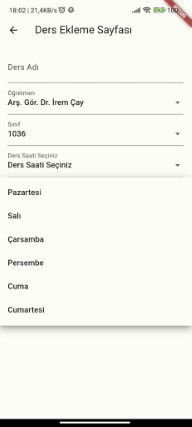
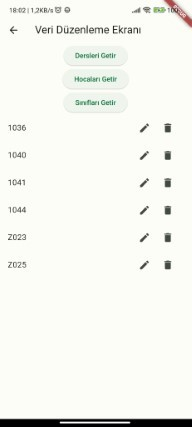

# Grup 40 2'No lu Yazılım Geliştirme Laboratuvarı-I Projesi

- Bu projede Flutter, Firebase Firestore, ARCore ve flutter_scalable_ocr.dart kütüphanesi kullanılarak bir Firestore veritabanı üzerinde çalışan ders programı uygulaması çalışması yapılmıştır.

- Proje içerisinde sınıfların ders programlarını görüntüleme, sisteme öğretim görevlisi ekleme, ders ekleme ve verileri düzenleme özellikleri bulunmaktadır.

- Proje kodları mümkün olduğunca dinamik çalışacak şekilde yazılmış olup değişmeye uygun bir şekilde oluşturulmaya çalışılmıştır.

## Projenin Çalıştırılması
1. öncelikle gerekli geliştirme ortamlarının kurulu olduğundan emin olunur.
- VS Code için:
     Dart Extension
        Flutter Extension
            Flutter SDK
                Android SDK 
1. Proje öncelikle 'git clone' komutu kullanılarak istenilen klasöre klonlanır.
## Uygulama Sayfaları

- Bu bölümde uygulamada bulunan sayfalar tanıtılacaktır.

### Ana Sayfa

- Uygulama ana sayfasında sınıf seçim kısmı, OCR fonksiyonu, Ders Ekleme Ekranı, Öğretim Görevlisi Ekleme Ekranı ve Veri Düzenleme Ekranı kısımları bulunmaktadır.

### Sınıf Görünümleri

- Sınıf Görünümleri kısmında boyuları içeriğe göre değişken bir Sütun yapısı kullanılmış ve Firestore veritabanı komutları kullanılarak "lessons" koleksiyonundan "className" alanı seçilen sınıfla uyan dersler yüklenmiş ve bir GridView içerisine yerleştirilmiştir.

### Ders Ekleme Ekranı

- Ders ekleme ekranında bir form mantığı kurulmuştur. veritabanı üzerinden alınan veriler gerekli kısımlara dağıtılarak kullanıcının yanlış ya da uyumsuz bir formatta ders eklemesi engellenmeye çalışılmıştır.

#### Ders Ekleme Durumunda Çakışmaları

- Ders saati, Sınıf, Öğretim Görevlisi müsaitliği ve Günler veritabanı içerisinde bir ders için aynı table'da olup olmadığı kontrol edilerek aynı seçeneklere ders eklenmesi engellenmiştir.

### Öğretim Görevlisi Ekleme Ekranı

- Bu ekranda Öğretim Görevlisinin Ünvanı, Adı ve Soyadı bilgileri alınarak "Ünvan+Ad+Soyad" sıralaması ile dosya ismi olarak ve içerisinde de "unvan", "ad" ve "soyad" field'larına kaydedilmektedir.

### Veri Düzenleme Ekranı

- Bu ekranda FutureBuilder yapısında QuerySnapshot yöntemi kullanılarak tıklanan butona göre istenen veriler alınarak Ders Ekleme Ekranı'nda ki mantığa benzer bir şekilde dağıtılmaktadır.

#### Veri Düzenleme Tuşu

- Veri düzenleme özelliği için main.dart dosyasındaki "\_dbVeriDuzenle" Future'ı kullanılarak alınan veri bir form'a dağıtılmakta ve form üzerinde düzenlendikten sonra kaydet butonuna basıldığında veritabanında uygun alanlar düzenlenen veri ile güncellenmektedir.

#### Veri Silme Tuşu

- Veri silme özelliği için main.dart dosyasındaki "\_dbVeriSil" Future'ı kullanılarak seçilen verinin collectionName'i ve documentId'si ile eşleşen table silinir.

